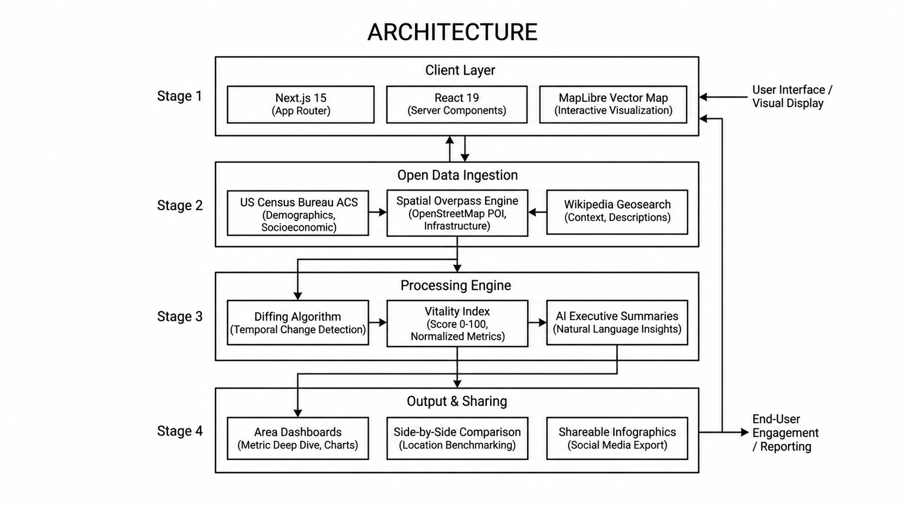

# What Changed Around Me?

> **Hyperlocal Spatial Intelligence & 10-Year US Census Shift Tracker for Any American Neighborhood.**

[](https://nextjs.org/)
[](https://react.dev/)
[](https://www.typescriptlang.org/)
[](https://maplibre.org/)
[](https://x.com/nilaymallikX)

---

## System Architecture



---

## Core Features

- **Instant ZIP Code Intelligence**: Resolve any 5-digit US ZIP code to extract live commercial changes, physical renovations, and unlisted places.
- **Official US Census Bureau Demographics**: Real-time ZCTA metrics covering Median Household Income, Population Growth, Housing Occupancy, Median Home Values, and 10-Year historical baselines.
- **Neighborhood Vitality Index (0–100)**: Multi-factor vitality algorithm scoring income trajectories (35%), commercial opening velocity (30%), housing occupancy (20%), and civic density (15%).
- **Side-by-Side Area Comparison (`/compare`)**: Direct head-to-head benchmarking between any two US neighborhoods with metric scorecards and dynamic SEO cards.
- **Map Time Machine**: Scrub historical eras (`2024–Present`, `2021–2023`, `2018–2020`, `All History`) with animated vector map pins.
- **Crime & Safety Context**: FBI Crime Data Explorer state trends plus real incident heatmaps from supported official municipal Socrata portals. Unsupported cities show trend-only coverage instead of generated incidents.
- **School Access & Education Resources**: Nearby public schools from the official NCES EDGE Common Core of Data, including enrollment, grade span, student/teacher ratios, distance, and a transparent access/resources index.
- **Dated Street Imagery**: Before/after comparison of compatible crowdsourced KartaView captures, with capture dates, source links, and explicit no-coverage states.
- **1-Click Shareable Infographics**: Generate high-resolution 1200x630 dark-theme social PNGs or post directly to X with pre-formatted stats.

---

## Technology Stack

| Layer | Technology |
| :--- | :--- |
| **Framework** | Next.js 15 (App Router with Server Components & Dynamic SEO) |
| **Frontend** | React 19, TypeScript, Tailwind CSS v4, Lucide Icons |
| **Map Visualization** | MapLibre GL + Carto Dark Vector Tiles |
| **Data Sources** | US Census ACS, FBI Crime Data Explorer, municipal Socrata portals, NCES EDGE, KartaView, Overpass, Wikipedia |
| **Database & Auth** | Supabase (PostgreSQL with RLS) + Local Offline Fallbacks |

---

## Quick Start

### 1. Clone & Install
```bash
git clone https://github.com/nilaymallikk/what-changed.git
cd what-changed
npm install
```

### 2. Configure Environment
Create a `.env` file in the root directory:
```env
CENSUS_API_KEY=your_census_api_key_here
NEXT_PUBLIC_SUPABASE_URL=https://your-project.supabase.co
NEXT_PUBLIC_SUPABASE_ANON_KEY=your_supabase_anon_key
```

### 3. Run Locally
```bash
npm run dev
```
Open [http://localhost:3000](http://localhost:3000) in your browser.

---

## Production Build & Quality Check

```bash
# Lint codebase
npm run lint

# Build production bundle
npm run build

# Start production server
npm run start
```

---

## Author

Built with precision by **[Nilay Mallik](https://x.com/nilaymallikX)**.

## License

Open-source under the [MIT License](LICENSE).
